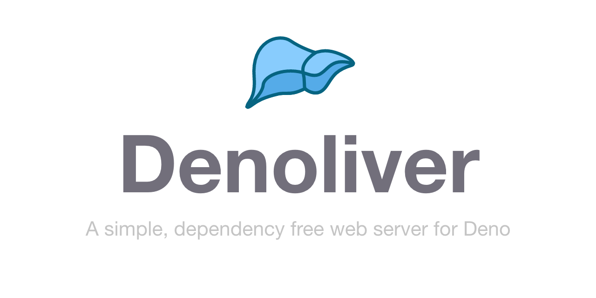
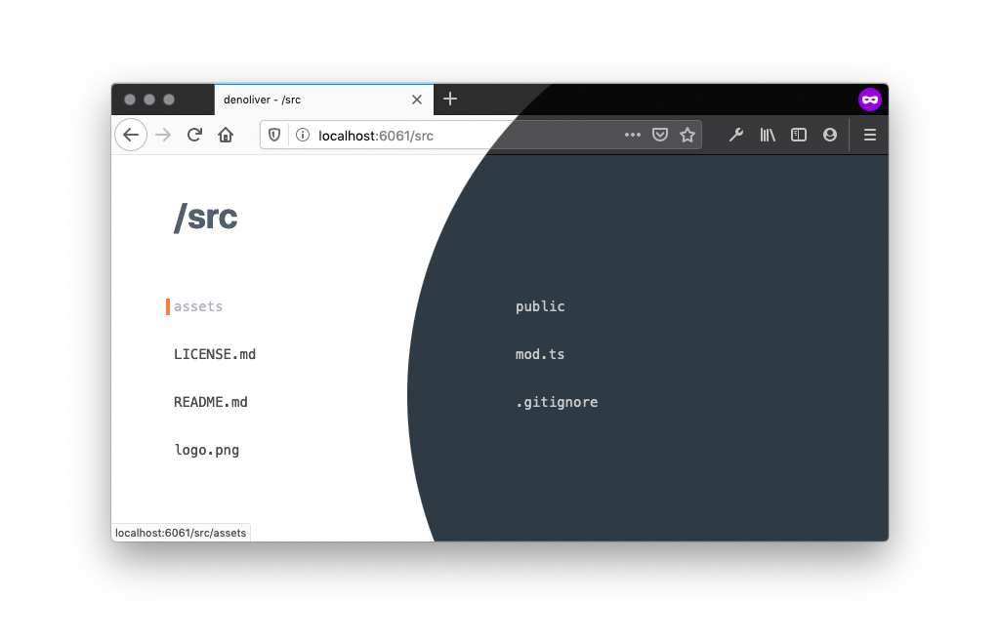

<p align="center">
  
</p>

<p align="center">
<a href="https://github.com/joakimunge/denoliver/actions">
</a>
<a href="https://github.com/joakimunge/denoliver/releases">
</a>
</p>

---

**Denoliver** is a small, zero config static file server with live reloading written in TypeScript for Deno intended for prototyping and Single Page Applications.

## Prerequisites

### To run this you need to have [Deno](https://deno.land/) 1.0 or later installed.

## Key Features

- Dependency free! No third party dependencies.
- Live reload of modified files.
- Supports client side routing for Single Page Applications.
- Supports HTTPS
- Allows for programmatic use as a module
- Boilerplating for rapid prototyping.

## Directory Listing

Denoliver supports indexing of served directories and provides a simple interface, with dark mode support, for navigating a project folder.

<p align="center">
  
</p>

## Install Denoliver as an executable

Install as a Deno executable.

> NOTE: Deno is a secure runtime by default. You need to include the `--allow-net`, `--allow-read` and `--allow-write` flags to make sure Denoliver can serve your directory.

```
$ deno install --allow-net --allow-read --allow-write https://deno.land/x/denoliver/mod.ts
```

or if you're not happy with the name:

```
$ deno install -n whateverNameYouWant --allow-net --allow-read --allow-write https://deno.land/x/denoliver/mod.ts
```

## Running

From your project root / directory you want to serve

```s
$ denoliver
```

### Options

Denoliver comes with a couple of options to customize your experience.

```s
-h                 # Help
-n                 # Disable live reload - Defaults to false
-s                 # Disable all output - Defaults to false
-p <PORT>          # Specify desired port - Defaults to 8080
-d                 # Debug for more verbose output - Defaults to false
-t                 # Use HTTPS - Requires a trusted self-signed certificate
-c                 # Use CORS - Defaults to false
--entry=<..>       # Specify optional entrypoint - Defaults to index.htmll
```

### Optional boilerplating

If the given directory doesn't exist, denoliver will ask you if you want to create a boilerplate. This will generate an a basic project folder and serve it for you. Very useful to get up and running quickly.

```
├── index.html
├── index.css
├── app.js
```

## Configuration

If you want, you can place a configuration file called `denoliver.json` in the folder you are serving to avoid having to use command line arguments to customize its behaviour. By default it will look like this:

```JSON
{
  "root": ".",
  "port": 8080,
  "disableReload": false,
  "silent": false,
  "debug": false,
  "secure": false,
  "cors": false,
  "entryPoint": "index.html"
}
```

## API

Denoliver can also be used as a module in any Deno project.
This exposes an instance of [Deno.Server](https://deno.land/std/http/server.ts#L125).

The main function accepts the same config object as specified in the config file above.

```typescript
import denoliver from 'https://deno.land/x/denoliver/mod.ts'

const server = denoliver({ port: 6060, cors: true })

server.close() // Close the server
```

## Serve over HTTPS

To use HTTPS you will need a trusted self-signed certificate. If you're on macOS you can use [This](https://github.com/kingkool68/generate-ssl-certs-for-local-development) bash script to easily generate one.

Name the cert and key files `denoliver.crt` and `denoliver.key` and place them in your working dir.

## Disclaimer

**This project is not intended for production use. It started out as a way for me personally to learn Deno, and is merely a tool to quickly get a file server up and running.**

## Acknowledgements

This project was heavily inspired by [lukejacksonn](https://github.com/lukejacksonn)s fantastic [Servor](https://github.com/lukejacksonn/servor/)
